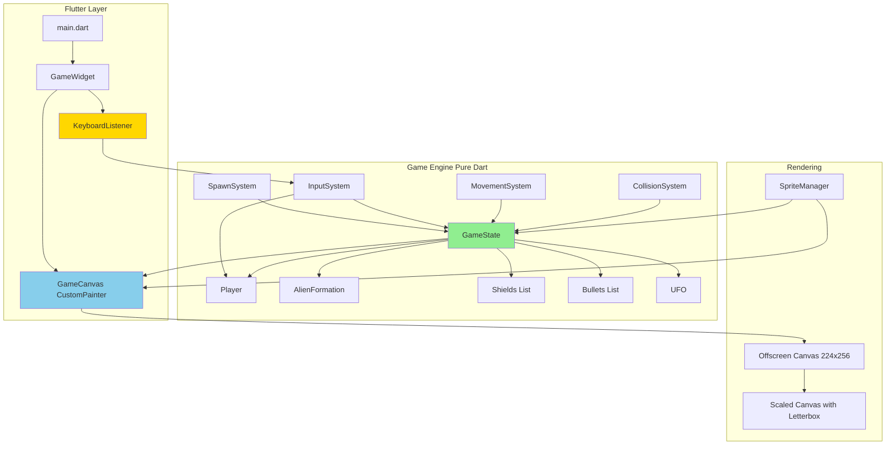

# DETAILED PLAN: SPACE INVADERS
## Pixel-Perfect Web Implementation

---

## GOAL

Deliver a pixel-perfect, modernized web implementation of Space Invaders (1978) that recreates the original arcade game's visual fidelity and core mechanics while running at 60 Hz in modern web browsers. The implementation will render at authentic 224×256 resolution with modern full-color sprites, scale gracefully to fit browser windows while maintaining aspect ratio, and provide keyboard-based single-player gameplay.

---

## PRODUCT REQUIREMENTS

### Core Features
- Single-player mode with 3 starting lives
- Player cannon: horizontal movement only, bottom of screen
- Player shooting: single-bullet-on-screen limitation (defining mechanic)
- Alien formation: 5 rows × 11 columns (55 total)
  - 3 types: Squid (top), Crab (middle), Octopus (bottom)
  - Scoring: 30, 20, 10 points respectively
- Alien movement: horizontal with directional reversal, 8-pixel vertical descent
- **Intentional difficulty progression:** Aliens speed up as destroyed
- Three alien bullet types (Rolling, Plunger, Squiggly) with visual distinction, simplified straight-down firing
- Four destructible shields with progressive damage states
- UFO/mystery ship: shot-counter-based appearance, pattern-based scoring
- Lives system with dual game-over conditions (death or invasion)
- Score tracking (displayed, not persisted)
- Wave progression (endless gameplay, fixed starting position)

### User Interface
- Title screen with instructions
- In-game HUD (score, lives)
- Game over screen with restart prompt
- Keyboard controls: Arrow keys (movement), Space (fire)

### Out of Scope (Post-MVP)
- Sound effects and music
- High score persistence
- Two-player mode
- Pause/settings menus
- Mobile/touch support
- Progressive wave starting positions
- Keyboard debug mode toggle

---

## PRINCIPLES

### Architecture Best Practices

**1. Separation of Concerns (SoC)**
- Game engine layer contains pure Dart logic with zero Flutter dependencies
- Rendering layer handles only visual presentation
- Input layer translates keyboard events to game commands
- Each layer has single, well-defined responsibility

**2. Single Responsibility Principle (SRP)**
- Each class has one reason to change
- GameObject subclasses manage only their own state
- Systems (Movement, Collision, Spawning) handle specific concerns
- Clear boundaries prevent coupling

**3. DRY (Don't Repeat Yourself)**
- GameObject base class provides common functionality
- Collision detection logic centralized in CollisionSystem
- Sprite rendering abstracted through SpriteManager
- Reusable algorithms (speed calculation, bounding box checks)

**4. Clear Contracts & Interfaces**
- Abstract GameObject defines contract for all game entities
- Consistent method signatures across systems
- Explicit state management through GameState
- Well-defined input/output for each algorithm

**5. Low Coupling, High Cohesion**
- Game logic independent of rendering technology
- Flutter layer can be swapped without changing game engine
- Related functionality grouped (AlienFormation manages all alien movement)
- Minimal dependencies between systems

**6. Testability First**
- Pure functions for algorithms (speed calculation, collision checks)
- Dependency injection for testable components
- Game state can be constructed programmatically for tests
- No global state or singletons

**7. KISS (Keep It Simple)**
- OOP over complex ECS for <100 entities
- Bounding-box collision over pixel-perfect
- Pre-defined shield damage states over dynamic destruction
- Simple array structures over complex spatial partitioning

**8. YAGNI (You Aren't Gonna Need It)**
- No sound system in MVP
- No persistence layer
- No settings/configuration
- No network/multiplayer infrastructure
- Defer all post-MVP features

**9. Observability & Debugging**
- Debug output for FPS monitoring
- Visual hitbox rendering (debug mode)
- Clear error messages for invalid states
- Logging for key game events

**10. Never Swallow Errors**
- Exceptions bubble up to caller
- No empty catch blocks
- Validation with meaningful error messages
- Failed assertions in test mode

**11. No Placeholder Code**
- Every function fully implemented before commit
- No TODO comments in production code
- Tests define completion criteria
- Feature complete or not started

**12. No Commented-Out Code**
- Git is version control
- Remove dead code immediately
- Comments explain "why," not "what"
- Clean, readable code over archaeological digs

---

## TECHNICAL REQUIREMENTS

### Front-End

**Platform:**
- Flutter Web (Dart SDK ≥ 3.0)
- Target browser: Chrome (via `flutter run`)
- No mobile/desktop support required

**Dependencies:**
- Flutter: Core framework
- vector_math: 2D math operations (Vector2, Matrix3)
- Standard Dart testing packages (test, flutter_test)

**Architecture Style:**
- Three-layer architecture (Engine, Rendering, Input)
- Object-oriented design with inheritance
- System-based logic organization (not full ECS)
- State machine for game screens

**Rendering:**
- Custom CustomPainter for game canvas
- Offscreen 224×256 canvas rendering
- Scaled blit to main canvas with letterboxing
- FilterQuality.none for pixel-perfect scaling
- Sprite atlas for efficient rendering

**Performance Targets:**
- Sustained 60 FPS in Chrome
- < 16.67ms frame time
- < 1 frame input latency

### Back-End

Not applicable (client-side only).

### Infrastructure

**Hosting:**
- Static web hosting (GitHub Pages, Firebase Hosting, or similar)
- No server-side logic required

**Deployment:**
- Flutter build web in release mode
- Deploy build artifacts to static host

**Monitoring:**
- Chrome DevTools for performance profiling
- FPS counter (debug build only)

**Observability:**
- Debug logging to console
- Visual debug overlays (hitboxes, grid positions) - compile-time only

---

## UX DESIGN

### User Workflows

**Workflow 1: First-Time User**
1. User navigates to URL in Chrome
2. Title screen loads, displaying game title
3. User reads controls: "← → MOVE, SPACE FIRE"
4. User presses SPACE
5. Game transitions to playing state
6. User learns mechanics through play
7. Game ends (death or invasion)
8. Game over screen shows final score
9. User presses SPACE to restart

**Workflow 2: Experienced Player**
1. Load game → immediate SPACE press
2. Gameplay loop:
   - Move cannon with arrows
   - Fire at aliens with SPACE
   - Dodge alien bullets
   - Use shields strategically
   - Destroy UFO when appears
3. Complete waves, accumulate score
4. Eventually die or get invaded
5. Quick restart with SPACE

**Workflow 3: Edge Cases**
- User resizes browser window → game rescales with letterboxing
- User holds arrow key → smooth continuous movement
- User spams SPACE → only one bullet fires at a time
- User leaves tab → game continues running (no pause)

### Screen Flows

```
[Title Screen]
     |
     | (press SPACE)
     ↓
[Playing]
     |
     | (lose all lives OR invasion)
     ↓
[Game Over]
     |
     | (press SPACE)
     ↓
[Title Screen] (reset, new game)
```

### Key Interactions

**Movement:**
- Press LEFT arrow → cannon moves left 2 pixels per frame
- Press RIGHT arrow → cannon moves right 2 pixels per frame
- Release key → cannon stops immediately
- Edge detection prevents moving off-screen

**Shooting:**
- Press SPACE → fire bullet (if none active)
- SPACE held → no additional bullets
- Bullet travels upward at 4 pixels per frame
- Bullet hits alien/UFO/shield → destroyed, new bullet allowed
- Bullet reaches top of screen → destroyed, new bullet allowed

**Visual Feedback:**
- Alien destroyed → explosion sprite, 16-frame display
- Player hit → explosion sprite, 60-frame pause, respawn
- Shield hit → advance to next damage state sprite
- Score increases → HUD updates immediately

### Responsiveness & Accessibility

**Responsive Scaling:**
- Game canvas maintains 224:256 aspect ratio
- Letterboxing adds black bars to fill viewport
- Calculate scale factor: minimum of (viewportWidth/224, viewportHeight/256)
- Center canvas in viewport
- No minimum viewport size - scales to any size

**Keyboard Accessibility:**
- All interactions keyboard-based (no mouse required)
- Standard arrow keys + space (universal)
- No modifier keys required
- Immediate response to key presses

**Visual Clarity:**
- High contrast (sprites on black background)
- Distinct colors for each alien type
- Crisp pixel rendering (no blur)
- Clear text rendering for scores

### Visual Specifications

**Screen Layouts (224×256 canvas):**

**Title Screen:**
- Background: Solid black
- Title "SPACE INVADERS" at vertical position 80, horizontally centered, white text
- Subtitle "PRESS SPACE TO START" at vertical position 140, horizontally centered, green text
- Control legend starting at vertical position 180, centered, gray text:
  - "CONTROLS:"
  - "← → MOVE"
  - "SPACE FIRE"

**Playing Screen:**
- Score display at vertical position 10, left-aligned, white text, format "SCORE: 0000"
- UFO zone at vertical positions 30-40
- Alien formation at vertical positions 60-100 (5 rows of 11 aliens each)
- Four shields at vertical position 180, evenly spaced horizontally
- Player cannon at vertical position 230
- Lives indicator at vertical position 245, left-aligned, small cannon icons

**Game Over Screen:**
- "GAME OVER" message at vertical position 100, centered, red text
- "FINAL SCORE: ####" at vertical position 130, centered, white text
- "PRESS SPACE TO RESTART" at vertical position 160, centered, green text

**Color Palette:**
- Background: Solid black (#000000)
- Score Text: White (#FFFFFF), 8-pixel monospace font
- Alien Squid (top row): Yellow (#FFFF00)
- Alien Crab (middle rows): Cyan (#00FFFF)
- Alien Octopus (bottom rows): Green (#00FF00)
- Player Cannon: Bright green (#00FF00)
- Bullets: White (#FFFFFF)
- Shields: Cyan (#00FFFF) with darker shades for damage states
- UFO: Red (#FF0000)
- Explosions: White/yellow burst pattern

**Animation Timing:**
- Alien walk cycle: 2-frame toggle on each movement step
- Explosions: Display for 16 frames (approximately 267 milliseconds)
- Player death: Explosion display followed by 60-frame pause before respawn

---

## TECHNICAL ARCHITECTURE & DESIGN

### System Architecture Overview

The implementation uses a three-layer architecture with clear separation between game logic, rendering, and input handling:

**Layer 1: Game Engine (Pure Dart)**
- Contains all game logic and state
- Zero Flutter dependencies
- Fully unit testable
- Exports: GameState, GameObject hierarchy, system logic

**Layer 2: Rendering (Flutter)**
- CustomPainter implementation
- Canvas scaling and letterboxing
- Sprite rendering
- Depends on: Game Engine + Flutter

**Layer 3: Input (Flutter)**
- Keyboard event listener
- Translates events to game commands
- Depends on: Game Engine + Flutter

**Data Flow:**
```
User Input → Input System → GameState.update() → Rendering Engine → Display
     ↑                                                   ↓
     └────────────────── Ticker (60 Hz) ─────────────────┘
```

### High-Level Architecture Diagram



### Core Algorithms

**Algorithm 1: Game Loop (60 Hz Fixed Timestep)**

```
CONSTANTS:
  TARGET_FPS = 60
  FRAME_TIME = 16.67 milliseconds

VARIABLES:
  accumulator = 0
  lastFrameTime = currentTime()

MAIN_LOOP (triggered by Flutter Ticker):
  currentTime = now()
  deltaTime = currentTime - lastFrameTime
  lastFrameTime = currentTime

  accumulator += deltaTime

  // Fixed timestep updates
  WHILE accumulator >= FRAME_TIME:
    processInput()
    updateGameState(FRAME_TIME)
    accumulator -= FRAME_TIME

  // Render with interpolation
  interpolationFactor = accumulator / FRAME_TIME
  render(interpolationFactor)
END MAIN_LOOP
```

**Rationale:** Fixed timestep ensures deterministic physics and movement. Accumulator pattern prevents spiral of death (when updates take longer than frame time). Interpolation provides smooth rendering between updates.

---

**Algorithm 2: Alien Formation Movement**

```
ALIEN_FORMATION_STATE:
  direction = RIGHT
  moveTimer = 0
  currentDelay = 55 frames  // Initial with 55 aliens

UPDATE(deltaTime):
  moveTimer += 1

  IF moveTimer >= currentDelay:
    moveTimer = 0

    // Check edge collision
    IF willHitScreenEdge(direction):
      moveAllAliensVertical(8 pixels downward)
      direction = reverse(direction)

      // Check invasion condition
      IF lowestAlienY >= INVASION_THRESHOLD:
        triggerGameOver(INVASION)
    ELSE:
      moveAllAliensHorizontal(direction, 2 pixels)

    // Recalculate speed based on survivors
    aliensRemaining = countActiveAliens()
    currentDelay = calculateFrameDelay(aliensRemaining)

    // Toggle animation
    FOR EACH alien IN formation:
      IF alien.isActive:
        alien.animationFrame = 1 - alien.animationFrame
END UPDATE

FUNCTION willHitScreenEdge(direction):
  IF direction == RIGHT:
    rightmostX = getRightmostAlienX()
    RETURN rightmostX + 2 >= SCREEN_WIDTH - MARGIN
  ELSE:
    leftmostX = getLeftmostAlienX()
    RETURN leftmostX - 2 <= MARGIN
```

**Rationale:** Synchronized movement maintains formation integrity. Edge detection prevents off-screen movement. Invasion check at each vertical drop ensures game-over condition triggers immediately.

---

**Algorithm 3: Speed Progression**

```
FUNCTION calculateFrameDelay(aliensRemaining):
  INITIAL_COUNT = 55
  MIN_DELAY = 5
  MAX_DELAY = 55

  aliensDestroyed = INITIAL_COUNT - aliensRemaining
  frameDelay = MAX_DELAY - aliensDestroyed
  frameDelay = max(MIN_DELAY, frameDelay)

  RETURN frameDelay

EXAMPLES:
  55 aliens → frameDelay = 55 frames (~0.92 seconds per step)
  28 aliens → frameDelay = 28 frames (~0.47 seconds per step)
  10 aliens → frameDelay = 10 frames (~0.17 seconds per step)
  1 alien  → frameDelay = 5 frames (~0.08 seconds per step)
```

**Rationale:** Linear progression provides smooth, predictable difficulty curve. One-to-one correspondence (each alien destroyed = one frame faster) is simple and testable. Minimum delay prevents impossibly fast speeds.

---

**Algorithm 4: Collision Detection**

```
FUNCTION checkAllCollisions():
  checkPlayerBulletCollisions()
  checkAlienBulletCollisions()
  checkInvasionCondition()

FUNCTION checkPlayerBulletCollisions():
  IF NOT playerBullet.isActive:
    RETURN

  // Check aliens (grid-optimized)
  gridPos = worldToGridPosition(playerBullet.position)
  IF isValidGridPosition(gridPos):
    alien = alienGrid[gridPos.row][gridPos.col]
    IF alien EXISTS AND alien.isActive:
      IF boundingBoxIntersect(playerBullet, alien):
        destroyAlien(alien, gridPos)
        destroyBullet(playerBullet)
        addScore(alien.pointValue)
        RETURN

  // Check UFO
  IF ufo.isActive:
    IF boundingBoxIntersect(playerBullet, ufo):
      score = getUFOScore()
      destroyUFO(ufo)
      destroyBullet(playerBullet)
      addScore(score)
      RETURN

  // Check shields
  FOR EACH shield IN shields:
    IF shield.isActive AND boundingBoxIntersect(playerBullet, shield):
      shield.advanceDamageState()
      destroyBullet(playerBullet)
      RETURN

FUNCTION checkAlienBulletCollisions():
  FOR EACH alienBullet IN alienBullets:
    IF NOT alienBullet.isActive:
      CONTINUE

    // Check player
    IF boundingBoxIntersect(alienBullet, player):
      destroyBullet(alienBullet)
      killPlayer()
      BREAK

    // Check shields
    FOR EACH shield IN shields:
      IF shield.isActive AND boundingBoxIntersect(alienBullet, shield):
        shield.advanceDamageState()
        destroyBullet(alienBullet)
        BREAK

FUNCTION boundingBoxIntersect(object1, object2):
  box1 = object1.getBoundingBox()
  box2 = object2.getBoundingBox()

  // Rectangles intersect if they overlap on both axes
  xOverlap = (box1.right > box2.left) AND (box1.left < box2.right)
  yOverlap = (box1.bottom > box2.top) AND (box1.top < box2.bottom)

  RETURN xOverlap AND yOverlap
```

**Rationale:** Grid lookup for aliens is O(1) constant time instead of O(n) linear search through all aliens. Bounding box collision is simple, performant, and accurate enough for this game style. Early returns prevent unnecessary checks after collision detected.

---

**Algorithm 5: Shield Damage State Machine**

```
SHIELD_DAMAGE_STATES = [PRISTINE, LIGHT_DAMAGE, HEAVY_DAMAGE, DESTROYED]

SHIELD:
  currentState = PRISTINE

FUNCTION takeDamage():
  stateIndex = indexOf(currentState, SHIELD_DAMAGE_STATES)

  IF stateIndex < length(SHIELD_DAMAGE_STATES) - 1:
    currentState = SHIELD_DAMAGE_STATES[stateIndex + 1]
    updateSprite(currentState)

  IF currentState == DESTROYED:
    isActive = FALSE

FUNCTION updateSprite(newState):
  sprite = loadSpriteForState(newState)
```

**Rationale:** State machine provides clear progression through damage levels. Pre-defined states simpler than pixel-level destruction. Four states provide sufficient visual feedback while remaining simple.

---

**Algorithm 6: UFO Spawn System**

```
UFO_SYSTEM:
  playerShotCount = 0
  scorePattern = [50, 100, 150, 200, 300]
  patternIndex = 0
  ufoActive = FALSE

FUNCTION onPlayerShoot():
  playerShotCount += 1

  IF (playerShotCount modulo 25) == 0 AND NOT ufoActive:
    spawnUFO()

FUNCTION spawnUFO():
  ufo.position = (0, UFO_Y_POSITION)  // Start at left edge
  ufo.velocity = (2, 0)  // Move rightward at 2 pixels per frame
  ufo.isActive = TRUE
  ufoActive = TRUE

FUNCTION getUFOScore():
  score = scorePattern[patternIndex]
  patternIndex = (patternIndex + 1) modulo 5
  RETURN score

FUNCTION onUFODestroyed():
  ufoActive = FALSE

FUNCTION onUFOEscaped():
  ufoActive = FALSE
```

**Rationale:** Shot-counter approach provides predictable but not exploitable UFO appearances. Pattern-based scoring adds variety without randomness. Modulo arithmetic ensures pattern cycles correctly.

---

**Algorithm 7: Simplified Alien Bullet Firing**

```
ALIEN_BULLET_SYSTEM:
  maxBullets = 3
  activeBullets = []
  fireTimer = 0
  fireDelay = 60 frames  // Initial delay between shots

UPDATE(deltaTime):
  fireTimer += 1

  IF fireTimer >= fireDelay AND length(activeBullets) < maxBullets:
    fireTimer = 0
    spawnAlienBullet()

FUNCTION spawnAlienBullet():
  // Select random active alien
  activeAliens = getAllActiveAliens()
  IF length(activeAliens) == 0:
    RETURN

  randomAlien = selectRandom(activeAliens)

  // Create bullet at alien position
  bullet = createBullet(
    position = randomAlien.position,
    type = selectRandomBulletType(),
    direction = DOWN,
    speed = 4
  )

  activeBullets.add(bullet)

FUNCTION selectRandomBulletType():
  types = [ROLLING, PLUNGER, SQUIGGLY]
  RETURN selectRandom(types)
```

**Rationale:** Simplified firing from random aliens easier to implement and test than complex column patterns. Three bullet types provide visual variety. Maximum three bullets maintains challenge without overwhelming player.

---

### Data Models & Schemas

**GameObject Hierarchy (Abstract Base and Concrete Types):**

**GameObject (Abstract Base Class):**
- Properties:
  - position: 2D vector (x, y coordinates in pixels)
  - size: 2D vector (width, height in pixels)
  - isActive: boolean flag indicating if object is alive/visible
- Methods:
  - update(deltaTime): called each frame to update object state
  - getBoundingBox(): returns rectangular collision bounds

**Player (extends GameObject):**
- Properties:
  - lives: integer count of remaining lives
  - moveSpeed: constant 2.0 pixels per frame
  - activeBullet: reference to player's bullet (null if none fired)
- Methods:
  - moveLeft(): shift position left by moveSpeed
  - moveRight(): shift position right by moveSpeed
  - shoot(): create bullet if activeBullet is null

**Alien (extends GameObject):**
- Properties:
  - type: enumeration (SQUID, CRAB, OCTOPUS)
  - pointValue: integer (30 for squid, 20 for crab, 10 for octopus)
  - animationFrame: integer (0 or 1 for two-frame walk cycle)
  - gridRow: integer position in formation (0-4)
  - gridColumn: integer position in formation (0-10)
- Methods:
  - toggleAnimation(): flip animationFrame between 0 and 1

**Bullet (extends GameObject):**
- Properties:
  - type: enumeration (PLAYER, ROLLING, PLUNGER, SQUIGGLY)
  - speed: constant 4.0 pixels per frame
  - direction: enumeration (UP for player, DOWN for aliens)
- Methods:
  - update(deltaTime): move bullet in direction at speed

**Shield (extends GameObject):**
- Properties:
  - state: enumeration (PRISTINE, LIGHT_DAMAGE, HEAVY_DAMAGE, DESTROYED)
- Methods:
  - takeDamage(): advance to next damage state

**UFO (extends GameObject):**
- Properties:
  - speed: constant 2.0 pixels per frame
  - direction: always horizontal (left-to-right or right-to-left)
- Methods:
  - update(deltaTime): move horizontally at speed

**AlienFormation (Composite Structure):**
- Properties:
  - grid: 2D array of Alien objects (5 rows × 11 columns, nullable entries)
  - direction: enumeration (LEFT or RIGHT)
  - moveTimer: integer frame counter
  - currentDelay: integer frames between moves
  - aliensRemaining: integer count of active aliens
- Methods:
  - update(deltaTime): increment timer, move when delay reached
  - moveHorizontal(pixels): shift all aliens horizontally
  - moveVertical(pixels): shift all aliens vertically
  - destroyAlien(row, column): remove alien from grid, update count
  - willHitEdge(): check if any alien at screen boundary
  - getLowestAlienY(): find lowest vertical position

**GameState (Central State Container):**
- Properties:
  - currentScreen: enumeration (TITLE, PLAYING, GAME_OVER)
  - score: integer point total
  - lives: integer remaining lives
  - waveNumber: integer current wave counter
  - playerShotCount: integer total shots fired by player
  - player: Player object
  - alienFormation: AlienFormation object
  - alienBullets: list of Bullet objects (maximum 3)
  - shields: list of 4 Shield objects
  - ufo: optional UFO object (null if not active)
- Methods:
  - update(deltaTime): update all game objects and systems
  - reset(): initialize new game state
  - startNewWave(): spawn new alien formation

**Supporting Data Structures:**

**Vector2:**
- Properties: x (double), y (double)
- Methods: addition, subtraction, scalar multiplication, magnitude

**Rect (Rectangle):**
- Properties: x (double), y (double), width (double), height (double)
- Derived properties: left, right, top, bottom edges

**Enumerations:**
- AlienType: SQUID, CRAB, OCTOPUS
- BulletType: PLAYER, ROLLING, PLUNGER, SQUIGGLY
- ShieldState: PRISTINE, LIGHT_DAMAGE, HEAVY_DAMAGE, DESTROYED
- GameScreen: TITLE, PLAYING, GAME_OVER
- Direction: LEFT, RIGHT, UP, DOWN

---

### API Contracts / Interfaces

**Game Engine Public API:**

The GameState class provides the primary interface for controlling the game:

**GameState Methods:**
- update(deltaTimeMs: double): Advances game simulation by specified milliseconds. Should be called at 60 Hz with 16.67ms intervals.
- processInput(input: GameInput): Handles user input commands. Translates high-level commands to game actions.
- reset(): Reinitializes all game state to starting conditions. Resets score, lives, wave number, and recreates all game objects.
- startNewWave(): Spawns new alien formation at fixed starting position.

**GameState Getters (Read-Only Access for Rendering):**
- player: Returns Player object for rendering position and state
- activeAliens: Returns list of all living Alien objects
- activeBullets: Returns list of all active Bullet objects (player + alien bullets)
- shields: Returns list of all Shield objects
- ufo: Returns UFO object if active, null otherwise
- score: Returns current point total
- lives: Returns remaining lives count
- currentScreen: Returns current game screen state

**Input Abstraction:**

GameInput enumeration defines all possible player actions:
- LEFT_PRESSED: Player holding left arrow key
- RIGHT_PRESSED: Player holding right arrow key
- FIRE_PRESSED: Player pressing space bar
- RESTART_PRESSED: Player pressing space on title/game-over screens
- NO_INPUT: No relevant input this frame

**Rendering Contract:**

All renderable game objects implement the Renderable concept:
- position property: Returns 2D vector of object's screen position
- currentSprite property: Returns sprite identifier for current animation frame
- getBoundingBox method: Returns rectangular collision bounds

---

### Integration Patterns

**Game Loop Integration with Flutter Ticker:**

The main game widget uses Flutter's Ticker mechanism to drive the game loop at 60 Hz. The integration follows these steps:

1. **Initialization:**
   - Create GameState instance
   - Create Ticker using widget's TickerProvider mixin
   - Start ticker immediately on widget initialization

2. **Per-Frame Update:**
   - Ticker callback receives elapsed duration since last frame
   - Calculate delta time in milliseconds
   - Add delta to accumulator
   - While accumulator exceeds frame time (16.67ms):
     - Call GameState.update() with fixed timestep
     - Subtract frame time from accumulator
   - Call setState() to trigger repaint

3. **Cleanup:**
   - Dispose ticker when widget disposed
   - Prevents memory leaks and background processing

**Input Integration with Keyboard Listener:**

The game widget wraps the canvas in a Focus widget with keyboard handling:

1. **Focus Setup:**
   - Request autofocus on widget build
   - Register onKey callback for keyboard events

2. **Key Event Translation:**
   - Listen for RawKeyDownEvent (key press)
   - Map LogicalKeyboardKey to GameInput enum:
     - Arrow Left → LEFT_PRESSED
     - Arrow Right → RIGHT_PRESSED
     - Space → FIRE_PRESSED or RESTART_PRESSED (context-dependent)
   - Call GameState.processInput() with translated command
   - Return KeyEventResult.handled to prevent propagation

3. **State-Dependent Handling:**
   - TITLE screen: Space triggers game start
   - PLAYING screen: Arrows move, Space fires
   - GAME_OVER screen: Space triggers restart

**Rendering Integration with Scaled Canvas:**

The CustomPainter implementation handles resolution scaling and letterboxing:

1. **Scale Calculation:**
   - Game native resolution: 224 × 256 pixels
   - Viewport size: provided by Flutter (variable)
   - Calculate scale factors: viewportWidth/224 and viewportHeight/256
   - Use minimum scale factor to maintain aspect ratio

2. **Letterbox Positioning:**
   - Calculate scaled dimensions: gameWidth × scale, gameHeight × scale
   - Calculate offsets: (viewportWidth - scaledWidth)/2 and (viewportHeight - scaledHeight)/2
   - Center scaled game canvas in viewport

3. **Two-Pass Rendering:**
   - **Pass 1 - Offscreen Canvas:** Create 224×256 canvas, draw all game objects at native resolution with pixel-perfect positioning
   - **Pass 2 - Scaled Blit:** Draw letterbox background (black), translate and scale canvas context, draw offscreen canvas to main viewport

4. **Pixel-Perfect Rendering:**
   - Use FilterQuality.none when drawing sprites to prevent bilinear filtering blur
   - Ensures crisp pixel art appearance when scaled

5. **Sprite Rendering:**
   - SpriteManager loads and caches all sprite images
   - Each game object requests sprite by type and animation frame
   - Canvas drawImageRect method used for hardware-accelerated rendering

**Asset Loading:**

The SpriteManager handles sprite asset loading and caching:

1. **Initialization Phase:**
   - Load existing Space Invaders sprite graphics or SVG drawings asynchronously during app startup
   - Convert to Flutter's Image type for canvas rendering
   - Store in map keyed by sprite type and frame number

2. **Runtime Access:**
   - Game objects request sprites by identifier
   - SpriteManager returns cached Image reference
   - No runtime loading or performance penalty

3. **Sprite Organization:**
   - Find and use existing classic Space Invaders sprite graphics or SVG files
   - Individual sprites extracted by source rectangle coordinates
   - Reduces memory overhead and improves cache locality

---

### State Management Strategy

**Simple Imperative State Management:**

The implementation uses straightforward imperative state management without reactive frameworks:

**Architecture:**
- Single GameState object holds all game data
- No streams, providers, BLoC pattern, or reactive frameworks
- State updates via direct method calls (GameState.update())
- Flutter widget rebuilds on every game tick (60 times per second)

**Rationale:**
- Game runs at 60 FPS, so widget rebuilds every frame regardless
- Reactive frameworks add complexity and overhead with no benefit
- Simpler to test: just call methods and assert state
- Predictable, deterministic state transitions
- No asynchronous concerns or race conditions

**State Machine for Game Screens:**

The game uses explicit state machine for screen transitions:

**States:**
- TITLE: Title screen with instructions, waiting for start input
- PLAYING: Active gameplay, all systems running
- GAME_OVER: Game over screen with final score, waiting for restart input

**Transitions:**
```
TITLE state:
  - Awaits SPACE key press
  - On SPACE: transition to PLAYING, reset game state

PLAYING state:
  - Updates all game objects each frame
  - Checks game-over conditions continuously
  - On lives == 0: transition to GAME_OVER
  - On aliens reach bottom: transition to GAME_OVER
  - On all aliens destroyed: spawn new wave (fixed position), remain in PLAYING

GAME_OVER state:
  - Displays final score
  - Awaits SPACE key press
  - On SPACE: transition to TITLE
```

**State Data Persistence:**

No data persists between game sessions:
- Score resets to zero on restart
- Wave number resets to one
- Lives reset to three
- No high score saved to storage

This aligns with MVP requirements (no persistence layer).

---

## QA & TEST STRATEGY (TDD ENFORCED)

### Test Philosophy

All development follows strict test-driven discipline:

1. **Write test FIRST:** Define expected behavior as executable test before implementation
2. **Run test (verify FAIL):** Confirm test fails with no implementation, validating test correctness
3. **Write minimum code to PASS:** Implement only enough to make test pass, no more
4. **Refactor:** Clean up code while keeping tests green
5. **Commit only when tests pass:** Never commit failing tests or untested code

### Test Levels

**Unit Tests (Pure Dart, Game Logic Layer):**

**Target:** 100% coverage of game engine logic

**Test Organization:**
- Separate test file for each source file
- Test files in test/ directory mirroring lib/ structure
- Example: lib/game_state.dart → test/game_state_test.dart

**Test Categories and Example Cases:**

**Player Tests (test/player_test.dart):**
- Player moves left: position decreases by 2 pixels per frame
- Player moves right: position increases by 2 pixels per frame
- Player respects left boundary: position never negative
- Player respects right boundary: position never exceeds screen width
- Player shoots: creates bullet if none active
- Player shoot limited: second shoot call while bullet active has no effect
- Player loses life: lives decrease by one when killed
- Player game over: game over triggered when lives reach zero

**Alien Formation Tests (test/alien_formation_test.dart):**
- Formation initializes: 55 aliens in 5×11 grid
- All aliens start active: no null entries initially
- Aliens move horizontally: all positions shift by 2 pixels in direction
- Direction reverses at edge: LEFT becomes RIGHT when rightmost alien hits edge
- Direction reverses at edge: RIGHT becomes LEFT when leftmost alien hits edge
- Aliens drop on reversal: all positions shift down 8 pixels when direction reverses
- Animation toggles: all alien animationFrame values flip 0↔1 on each step
- Alien destruction: removing alien sets grid entry to null, decrements count
- Speed calculation accurate: formula produces expected delays for various alien counts

**Collision System Tests (test/collision_system_test.dart):**
- Player bullet hits alien: alien destroyed, bullet destroyed, score increased
- Player bullet hits UFO: UFO destroyed, bullet destroyed, score increased by pattern value
- Player bullet hits shield: shield damaged, bullet destroyed
- Alien bullet hits player: player loses life, bullet destroyed
- Alien bullet hits shield: shield damaged, bullet destroyed
- Bullet-bullet collision: bullets pass through each other (no collision)
- Grid lookup optimization: worldToGrid conversion produces correct row/column
- Bounding box overlap: returns true when rectangles intersect
- Bounding box separated: returns false when rectangles don't touch

**Shield Tests (test/shield_test.dart):**
- Shield initializes: state is PRISTINE
- First damage: state advances to LIGHT_DAMAGE
- Second damage: state advances to HEAVY_DAMAGE
- Third damage: state advances to DESTROYED, isActive becomes false
- Destroyed shields: bullets pass through without collision

**UFO Tests (test/ufo_test.dart):**
- UFO spawns on 25th shot: ufo becomes active after playerShotCount reaches 25
- UFO doesn't spawn before: ufo remains null for shots 1-24
- UFO spawns on multiples of 25: appears at shots 25, 50, 75, etc.
- UFO doesn't spawn if active: second trigger while UFO active has no effect
- UFO score pattern: getUFOScore() returns [50, 100, 150, 200, 300] in sequence
- UFO pattern cycles: after 300, next score is 50 (pattern repeats)

**Algorithm Tests (test/algorithms_test.dart):**
- Speed formula with full formation: 55 aliens → delay 55 frames
- Speed formula mid-game: 28 aliens → delay 28 frames
- Speed formula near end: 10 aliens → delay 10 frames
- Speed formula minimum enforced: 1 alien → delay 5 frames (not 1)
- Bounding box overlap horizontally and vertically: returns true
- Bounding box overlap only horizontally: returns false
- Bounding box overlap only vertically: returns false
- Bounding box completely separated: returns false

---

**Integration Tests (Multi-Frame Scenarios):**

**Target:** System interactions and multi-step gameplay sequences

**Test Organization:**
- Integration tests in test/integration/ directory
- Test files named by scenario (full_wave_test.dart, game_over_test.dart)

**Example Scenarios:**

**Complete Wave Progression (test/integration/full_wave_test.dart):**
- Initialize game state in PLAYING mode
- Destroy all 55 aliens one by one
- Verify alien count reaches zero
- Update game state one frame
- Verify new wave spawned: wave number incremented, alien count reset to 55
- Verify aliens spawn at fixed position (not progressive)

**Game Over by Death (test/integration/game_over_test.dart):**
- Initialize game with 1 life remaining
- Spawn alien bullet at player position
- Update game state to trigger collision
- Verify player killed, lives reach zero
- Verify game state transitions to GAME_OVER screen

**Game Over by Invasion (test/integration/game_over_test.dart):**
- Initialize game state
- Manually position lowest alien at invasion threshold
- Update game state one frame
- Verify game over triggered regardless of remaining lives
- Verify game state transitions to GAME_OVER screen

**Full Game Loop (test/integration/state_machine_test.dart):**
- Start in TITLE state
- Process SPACE input
- Verify transition to PLAYING state
- Trigger game over condition
- Verify transition to GAME_OVER state
- Process SPACE input
- Verify transition back to TITLE state

---

**Widget Tests (Flutter Rendering Layer):**

**Target:** Rendering correctness and user interface

**Test Organization:**
- Widget tests in test/widget/ directory
- Test files named by screen/component (title_screen_test.dart, hud_test.dart)

**Example Test Cases:**

**Title Screen Tests (test/widget/title_screen_test.dart):**
- Title renders: "SPACE INVADERS" text present on screen
- Instructions render: "PRESS SPACE TO START" text present
- Controls legend renders: arrow and space key instructions present
- SPACE key transitions: pressing space changes currentScreen to PLAYING

**Game Over Screen Tests (test/widget/game_over_screen_test.dart):**
- Game over message: "GAME OVER" text present
- Final score displays: score value rendered correctly
- Restart prompt: "PRESS SPACE TO RESTART" text present
- SPACE key transitions: pressing space changes currentScreen to TITLE

**HUD Tests (test/widget/hud_test.dart):**
- Score displays: score text present during PLAYING state
- Score updates: score value changes when alien destroyed
- Lives indicator: correct number of cannon icons displayed
- Lives decrease: icon count decreases when player dies

**Scaling Tests (test/widget/scaling_test.dart):**
- Letterbox at wide aspect: black bars on left and right
- Letterbox at tall aspect: black bars on top and bottom
- Game centered: scaled game canvas centered in viewport
- Aspect ratio maintained: game always 224:256 ratio regardless of viewport

**Keyboard Input Tests (test/widget/keyboard_input_test.dart):**
- Left arrow moves player: player position decreases when left arrow pressed
- Right arrow moves player: player position increases when right arrow pressed
- Space fires: bullet created when space pressed in PLAYING state
- Space starts game: state changes to PLAYING when space pressed in TITLE state

---

### Edge Cases & Failure Modes

**Critical Edge Cases to Test:**

**Last Alien Behavior:**
- Test case: Destroy 54 of 55 aliens, observe final alien movement
- Expected: Alien moves correctly at maximum speed (5-frame delay)
- Expected: No buggy asymmetry in movement pattern

**Bottom-Row Alien Shooting:**
- Test case: Position alien in bottom row (row 0), trigger alien shooting
- Expected: Bullet spawns at alien's position, not below player
- Expected: Bullet can hit player normally

**Bullet Limits:**
- Test case: Player shoots, shoots again before bullet destroyed
- Expected: Only one player bullet exists
- Test case: Spawn three alien bullets, attempt fourth
- Expected: Maximum three alien bullets active simultaneously

**Bullet-Bullet Collision:**
- Test case: Player bullet and alien bullet on collision course
- Expected: Bullets pass through each other, no collision detected

**Shield Edge Cases:**
- Test case: Shield takes damage three times, reaches DESTROYED state
- Expected: Shield becomes inactive
- Test case: Bullet collides with destroyed shield
- Expected: Bullet passes through, no collision

**UFO Edge Cases:**
- Test case: UFO moves across screen, reaches opposite edge
- Expected: UFO deactivates gracefully, no crash
- Test case: UFO active, playerShotCount reaches next multiple of 25
- Expected: No second UFO spawns while first active
- Test case: Destroy UFO five times
- Expected: Score pattern [50, 100, 150, 200, 300] cycles correctly

**Collision Boundary Edge Cases:**
- Test case: Aliens at screen edge move toward boundary
- Expected: Aliens reverse without incorrect collision detection
- Test case: Player at screen edge presses movement key toward edge
- Expected: Player doesn't move off-screen
- Test case: Bullet reaches top or bottom of screen
- Expected: Bullet destroyed, doesn't crash or wrap

**State Transition Edge Cases:**
- Test case: Game over triggered, press SPACE, press SPACE again
- Expected: TITLE → PLAYING → new game loop
- Test case: Press SPACE rapidly during transition
- Expected: No double-transitions or invalid states
- Test case: Restart game, verify all state cleared
- Expected: No memory of previous game (score, positions, etc.)

---

### Performance, Security, Reliability Goals

**Performance Targets:**

**Frame Rate:**
- Target: Sustained 60 FPS in Chrome
- Measurement: Chrome DevTools FPS meter
- Acceptance: Average ≥59 FPS, minimum ≥55 FPS (brief spikes acceptable)

**Frame Time:**
- Target: Average frame time <16ms
- Target: Maximum frame time <20ms (rare spikes only)
- Measurement: Chrome DevTools Performance profiler
- Acceptance: 95th percentile frame time ≤16ms

**Input Latency:**
- Target: <1 frame delay (< 16.67ms from key press to visual update)
- Measurement: Manual observation, high-speed camera if needed
- Acceptance: No perceptible lag between input and response

**Memory:**
- Target: No memory growth over extended play session
- Measurement: Chrome DevTools Memory profiler over 10-minute session
- Acceptance: Flat or sawtooth memory profile (garbage collection), no continuous growth

**Security:**

Not applicable for this project:
- Client-side only application
- No user data collected or stored
- No external API calls or network communication
- No authentication or authorization

**Reliability:**

**Crash-Free Operation:**
- Target: Zero crashes in 1-hour continuous play session
- Test: Automated long-running integration test or manual playtest
- Acceptance: No uncaught exceptions or fatal errors

**Edge Case Handling:**
- Target: All identified edge cases handled gracefully
- Test: Comprehensive edge case test suite
- Acceptance: No undefined behavior or crashes

**Determinism:**
- Target: Identical inputs produce identical outputs
- Test: Record input sequence, replay multiple times
- Acceptance: Bit-identical game state at each frame
- Note: No race conditions or non-deterministic behavior

---

### Quality Gates

**Before Milestone Completion, All Criteria Must Pass:**

**1. Unit Test Gate:**
- All unit tests execute successfully
- No skipped or pending tests
- Code coverage ≥90% of game engine logic

**2. Integration Test Gate:**
- All integration tests execute successfully
- Multi-frame scenarios complete without errors

**3. Widget Test Gate:**
- All widget tests execute successfully
- Rendering tests validate visual correctness

**4. Manual Playthrough Gate:**
- Complete at least one full wave
- Verify all mechanics work as specified
- No visual glitches or rendering errors

**5. Performance Gate:**
- 60 FPS sustained during manual playthrough
- Chrome DevTools FPS meter validation
- No frame drops or stuttering

**6. Input Responsiveness Gate:**
- All keyboard inputs respond within 1 frame
- No dropped inputs during gameplay
- Movement feels smooth and precise

**7. Code Quality Gate:**
- No console errors or warnings
- No commented-out code
- No TODO comments in production code
- All functions fully implemented

**8. Code Review Gate (if team):**
- Peer review completed
- All review comments addressed
- Architecture principles followed

---

## MILESTONES & TDD GATES

### Milestone 1: MVP - Core Gameplay
**Timeline:** Weeks 1-3
**Objective:** Deliver fully playable single-wave game with all core mechanics

#### Test Assets (Create FIRST - Before Any Implementation)

**Unit Test Suite:**

**test/player_test.dart:**
- Test: Player initializes with 3 lives
- Test: Player position starts at bottom-center of screen
- Test: moveLeft() decreases x position by 2 pixels
- Test: moveRight() increases x position by 2 pixels
- Test: moveLeft() at left edge does nothing (boundary check)
- Test: moveRight() at right edge does nothing (boundary check)
- Test: shoot() creates bullet when activeBullet is null
- Test: shoot() does nothing when activeBullet exists (enforcement of single-bullet rule)
- Test: losing life decreases lives by 1
- Test: losing life at 0 lives triggers game over

**test/alien_formation_test.dart:**
- Test: Formation initializes with 55 aliens (5 rows × 11 columns)
- Test: All aliens initially active (no nulls in grid)
- Test: Aliens start with direction RIGHT
- Test: moveHorizontal(RIGHT, 2) shifts all alien x positions by +2
- Test: moveHorizontal(LEFT, 2) shifts all alien x positions by -2
- Test: moveVertical(8) shifts all alien y positions by +8
- Test: willHitEdge() returns true when rightmost alien within 2 pixels of right boundary
- Test: willHitEdge() returns true when leftmost alien within 2 pixels of left boundary
- Test: destroyAlien(row, col) sets grid entry to null
- Test: destroyAlien(row, col) decrements aliensRemaining counter
- Test: toggleAnimation() flips all alien animationFrame values (0→1, 1→0)
- Test: calculateFrameDelay() with 55 aliens returns 55
- Test: calculateFrameDelay() with 28 aliens returns 28
- Test: calculateFrameDelay() with 1 alien returns 5 (minimum enforced)

**test/collision_system_test.dart:**
- Test: Overlapping rectangles return true for boundingBoxIntersect()
- Test: Separated rectangles return false for boundingBoxIntersect()
- Test: Touching rectangles (shared edge) return false
- Test: worldToGrid() converts world position to correct grid coordinates
- Test: worldToGrid() with out-of-bounds position returns invalid grid coordinates
- Test: Player bullet hitting alien destroys both, increases score by alien point value
- Test: Player bullet hitting UFO destroys both, increases score by UFO pattern value
- Test: Player bullet hitting shield damages shield, destroys bullet
- Test: Alien bullet hitting player destroys bullet, decreases player lives
- Test: Alien bullet hitting shield damages shield, destroys bullet
- Test: Player bullet and alien bullet pass through each other (no collision)

**test/shield_test.dart:**
- Test: Shield initializes in PRISTINE state
- Test: takeDamage() from PRISTINE advances to LIGHT_DAMAGE
- Test: takeDamage() from LIGHT_DAMAGE advances to HEAVY_DAMAGE
- Test: takeDamage() from HEAVY_DAMAGE advances to DESTROYED
- Test: takeDamage() from DESTROYED has no effect (already destroyed)
- Test: DESTROYED state sets isActive to false
- Test: Bullet collision with DESTROYED shield returns false (no collision)

**test/ufo_test.dart:**
- Test: UFO does not spawn before 25th shot (shots 1-24)
- Test: UFO spawns on exactly 25th shot
- Test: UFO spawns on 50th shot (second appearance)
- Test: UFO does not spawn on 26th shot (not a multiple of 25)
- Test: UFO does not spawn if UFO already active
- Test: getUFOScore() returns scores in pattern [50, 100, 150, 200, 300]
- Test: getUFOScore() cycles back to 50 after 300
- Test: UFO escaping off-screen sets ufoActive to false

**test/game_state_test.dart:**
- Test: GameState initializes with score 0, lives 3, wave 1
- Test: reset() reinitializes all state to starting values
- Test: startNewWave() creates new alien formation with 55 aliens at fixed position
- Test: Game over when lives reach 0
- Test: Game over when any alien y position >= invasion threshold

---

**Integration Test Scenarios:**

**test/integration/full_wave_test.dart:**
- Scenario: Complete wave destruction
  - Initialize GameState in PLAYING mode
  - Iterate through all 55 aliens, calling destroyAlien() for each
  - Verify aliensRemaining reaches 0
  - Call GameState.update() one frame
  - Assert: waveNumber incremented to 2
  - Assert: New alien formation spawned with 55 aliens at fixed position

**test/integration/game_over_test.dart:**
- Scenario: Game over by death
  - Initialize GameState with player.lives = 1
  - Position alien bullet at player location
  - Call GameState.update() to trigger collision
  - Assert: player.lives = 0
  - Assert: currentScreen = GAME_OVER

- Scenario: Game over by invasion
  - Initialize GameState
  - Manually set lowest alien y position to invasion threshold
  - Call GameState.update()
  - Assert: currentScreen = GAME_OVER
  - Assert: Lives unchanged (invasion takes precedence)

**test/integration/collision_chain_test.dart:**
- Scenario: Bullet destroys alien, triggers speed increase
  - Initialize GameState with 55 aliens, frameDelay = 55
  - Fire player bullet, position to hit specific alien
  - Call GameState.update() to trigger collision
  - Assert: Alien destroyed (grid entry null)
  - Assert: Score increased by alien point value
  - Assert: Bullet destroyed (isActive = false)
  - Assert: frameDelay recalculated to 54

---

#### Test Execution (BEFORE Implementation)

Run command: `flutter test`

**Expected Output:**
- All tests FAIL (no implementation exists yet)
- Test framework successfully compiles and executes
- Error messages indicate missing classes and methods

**Purpose of Pre-Implementation Test Run:**
- Validates test structure is correct
- Confirms test framework setup
- Establishes baseline of "all red" before going "green"

---

#### Implementation Order (TDD Cycle for Each Item)

**Phase 1: Foundation (Week 1)**

1. **GameObject Base Class:**
   - Write failing test for GameObject properties (position, size, isActive)
   - Implement GameObject abstract class
   - Run tests → pass
   - Refactor if needed

2. **Vector2 and Rect Utilities:**
   - Write failing tests for vector math operations
   - Implement Vector2 class
   - Write failing tests for rectangle operations
   - Implement Rect class
   - Run tests → pass

3. **GameState Skeleton:**
   - Write failing test for GameState initialization
   - Implement GameState class with empty methods
   - Run tests → pass

**Phase 2: Player (Week 1)**

4. **Player Class:**
   - Write failing tests for Player initialization
   - Implement Player class extending GameObject
   - Run tests → pass

5. **Player Movement:**
   - Write failing tests for moveLeft(), moveRight()
   - Implement movement methods
   - Run tests → pass
   - Write failing tests for boundary detection
   - Implement boundary checks
   - Run tests → pass

6. **Player Shooting:**
   - Write failing test for shoot() creating bullet
   - Implement bullet creation
   - Run tests → pass
   - Write failing test for single-bullet limit
   - Implement bullet limit enforcement
   - Run tests → pass

**Phase 3: Aliens (Week 2)**

7. **Alien Class:**
   - Write failing tests for Alien types and properties
   - Implement Alien class
   - Run tests → pass

8. **AlienFormation Grid:**
   - Write failing test for 5×11 grid initialization
   - Implement AlienFormation class with grid
   - Run tests → pass

9. **Formation Movement:**
   - Write failing tests for moveHorizontal()
   - Implement horizontal movement
   - Run tests → pass
   - Write failing tests for moveVertical()
   - Implement vertical movement
   - Run tests → pass

10. **Direction Reversal:**
    - Write failing tests for edge detection
    - Implement willHitEdge()
    - Run tests → pass
    - Write failing tests for reversal behavior
    - Implement reversal logic
    - Run tests → pass

11. **Speed Progression:**
    - Write failing tests for calculateFrameDelay() with various alien counts
    - Implement speed calculation algorithm
    - Run tests → pass

**Phase 4: Collision (Week 2)**

12. **Collision System Foundation:**
    - Write failing tests for boundingBoxIntersect()
    - Implement bounding box collision detection
    - Run tests → pass

13. **Grid-Based Alien Lookup:**
    - Write failing tests for worldToGrid()
    - Implement coordinate conversion
    - Run tests → pass

14. **Collision Handlers:**
    - Write failing tests for each collision type (bullet-alien, bullet-shield, etc.)
    - Implement collision detection and response
    - Run tests → pass for each type

**Phase 5: Shields (Week 2)**

15. **Shield Class:**
    - Write failing tests for Shield state machine
    - Implement Shield class with state progression
    - Run tests → pass

16. **Shield Damage:**
    - Write failing tests for takeDamage() state transitions
    - Implement damage logic
    - Run tests → pass

**Phase 6: Game Loop Integration (Week 3)**

17. **Fixed Timestep Loop:**
    - Write failing tests for accumulator pattern
    - Implement game loop with fixed timestep
    - Run tests → pass

18. **System Integration:**
    - Write failing integration tests
    - Wire all systems together in GameState.update()
    - Run integration tests → pass

---

#### Test Execution Summary (AFTER Implementation)

Run command: `flutter test`

**Expected Output:**
- All unit tests: PASS (~50-60 tests)
- All integration tests: PASS (~10-15 tests)
- Code coverage: >90% of game engine code
- Test execution time: <30 seconds

**Success Criteria:**
- Zero failing tests
- Zero skipped tests
- No console warnings or errors
- Coverage report shows high percentage

---

#### Manual Testing Checklist

Perform these manual tests in Chrome browser:

- [ ] Launch game with `flutter run -d chrome`
- [ ] Verify game renders centered with letterboxing
- [ ] Press LEFT arrow → player cannon moves left smoothly
- [ ] Press RIGHT arrow → player cannon moves right smoothly
- [ ] Player stops at left edge, cannot move further left
- [ ] Player stops at right edge, cannot move further right
- [ ] Press SPACE → bullet fires upward
- [ ] Press SPACE again immediately → no second bullet (limit enforced)
- [ ] Bullet hits alien → alien disappears, score increases
- [ ] Verify score increase matches alien type (10/20/30 points)
- [ ] Aliens move horizontally in synchronized formation
- [ ] Aliens reverse direction at screen edge and drop 8 pixels
- [ ] Aliens speed up noticeably as aliens destroyed
- [ ] Last alien moves at maximum speed
- [ ] Alien bullets fire downward (simplified random firing)
- [ ] Alien bullet hits player → explosion, life lost
- [ ] Verify lives decrease by 1
- [ ] Player respawns after brief pause
- [ ] Bullet hits shield → shield shows damage
- [ ] Shield progresses through 4 damage states
- [ ] Fully destroyed shield allows bullets to pass through
- [ ] Destroy all 55 aliens → new wave spawns at fixed position
- [ ] Wave number increments
- [ ] Lose all 3 lives → game over
- [ ] Aliens reach bottom → game over immediately
- [ ] Open Chrome DevTools → Performance tab
- [ ] Record 30-second gameplay session
- [ ] Verify FPS stays at 60 (check FPS meter)
- [ ] Verify frame time averages <16ms

---

#### Implementation Notes (Document During Development)

Track these items during implementation:

**Edge Cases Discovered:**
- Document any edge cases found during testing that weren't anticipated
- Add tests for newly discovered edge cases
- Note resolution approach

**Performance Bottlenecks:**
- Note any performance issues encountered
- Document profiling results
- Record optimizations applied and impact

**Deviations from Plan:**
- Document any deviations from original technical design
- Explain rationale for changes
- Update plan document if changes are significant

**Technical Debt:**
- Note any shortcuts or temporary solutions
- Create issues for future cleanup
- Estimate effort to resolve

**Sprite Assets:**
- Document sources for classic Space Invaders sprites found
- Note any modifications needed for Flutter compatibility
- Track sprite dimensions verified against specifications

---

#### Demo & Acceptance Criteria

**PO Demo Session:**

1. **Complete Wave Playthrough:**
   - PO plays game from start
   - Destroys all 55 aliens
   - Observes new wave spawn at fixed position
   - Confirms: Movement feels responsive and smooth

2. **Scoring Verification:**
   - Destroy bottom-row alien (octopus) → verify +10 points
   - Destroy middle-row alien (crab) → verify +20 points
   - Destroy top-row alien (squid) → verify +30 points
   - Confirms: Scoring is accurate

3. **Collision Fairness:**
   - Observe player bullet hitting aliens
   - Observe alien bullets hitting player (simplified firing)
   - Observe shield damage progression
   - Confirms: Collisions feel fair and accurate

4. **Game Over Conditions:**
   - Lose all 3 lives → verify game over
   - Allow aliens to reach bottom → verify immediate game over
   - Confirms: Game over conditions work correctly

5. **Performance:**
   - Play for 5 minutes continuously
   - Observe smoothness and responsiveness
   - Check Chrome DevTools FPS counter
   - Confirms: 60 FPS maintained throughout

**Acceptance Decision:**
- [ ] All automated tests pass
- [ ] Manual testing checklist complete
- [ ] PO demo successful
- [ ] Performance targets met
- [ ] No critical bugs identified

**Gate Status:** If all criteria met → **Milestone 1 COMPLETE**

---

### Milestone 2: Game States & UX Polish
**Timeline:** Week 4
**Objective:** Complete game loop with title/game over screens, HUD, and state transitions

#### Test Assets (Create FIRST)

**Widget Test Suite:**

**test/widget/title_screen_test.dart:**
- Test: Title screen renders "SPACE INVADERS" text
- Test: Title screen renders "PRESS SPACE TO START" text
- Test: Title screen renders control instructions
- Test: Title screen renders on black background
- Test: SPACE key press transitions from TITLE to PLAYING state
- Test: Arrow keys have no effect in TITLE state

**test/widget/game_over_screen_test.dart:**
- Test: Game over screen renders "GAME OVER" text in red
- Test: Game over screen renders "FINAL SCORE:" with score value
- Test: Game over screen renders "PRESS SPACE TO RESTART" text
- Test: Score value matches GameState.score
- Test: SPACE key press transitions from GAME_OVER to TITLE state
- Test: Arrow keys have no effect in GAME_OVER state

**test/widget/hud_test.dart:**
- Test: HUD renders score text in top-left corner
- Test: Score text format "SCORE: ####" with zero-padded value
- Test: Lives indicator renders correct number of cannon icons
- Test: Lives indicator positioned at bottom-left
- Test: HUD visible during PLAYING state
- Test: HUD not visible during TITLE or GAME_OVER states

**test/widget/scaling_test.dart:**
- Test: Letterbox with wide viewport (16:9) adds black bars on sides
- Test: Letterbox with tall viewport (9:16) adds black bars on top/bottom
- Test: Game canvas centered horizontally in wide viewport
- Test: Game canvas centered vertically in tall viewport
- Test: Game maintains 224:256 aspect ratio regardless of viewport
- Test: FilterQuality.none applied to sprite rendering (no blur)

---

**State Transition Tests:**

**test/integration/state_machine_test.dart:**
- Test: Game initializes in TITLE state
- Test: SPACE in TITLE transitions to PLAYING
- Test: GameState.reset() called on TITLE→PLAYING transition
- Test: Player lives = 0 transitions to GAME_OVER
- Test: Aliens reach bottom transitions to GAME_OVER
- Test: Final score preserved in GAME_OVER state
- Test: SPACE in GAME_OVER transitions to TITLE
- Test: Complete cycle TITLE→PLAYING→GAME_OVER→TITLE

---

#### Implementation Order (TDD)

**Phase 1: State Machine (Days 1-2)**

1. **GameScreen Enum:**
   - Write failing test for GameScreen values
   - Add GameScreen enum to GameState
   - Run tests → pass

2. **Title Screen Rendering:**
   - Write failing widget tests for title screen
   - Implement title screen rendering in CustomPainter
   - Run tests → pass

3. **Title Screen Input:**
   - Write failing test for SPACE transition
   - Implement input handling in TITLE state
   - Run tests → pass

**Phase 2: Game Over Screen (Days 2-3)**

4. **Game Over Rendering:**
   - Write failing widget tests for game over screen
   - Implement game over rendering in CustomPainter
   - Run tests → pass

5. **Game Over Input:**
   - Write failing test for SPACE restart
   - Implement input handling in GAME_OVER state
   - Run tests → pass

**Phase 3: HUD (Days 3-4)**

6. **Score Display:**
   - Write failing test for score rendering
   - Implement score text rendering
   - Run tests → pass

7. **Lives Indicator:**
   - Write failing test for lives rendering
   - Implement lives icon rendering
   - Run tests → pass

**Phase 4: State Transitions (Day 4)**

8. **Transition Logic:**
   - Write failing integration tests for state transitions
   - Implement state machine in GameState.update()
   - Run tests → pass

9. **Reset Logic:**
   - Write failing test for GameState.reset()
   - Implement reset method
   - Run tests → pass

**Phase 5: Polish (Day 5)**

10. **Visual Polish:**
    - Verify text rendering quality
    - Adjust font sizes and positioning
    - Ensure consistent styling

---

#### Manual Testing Checklist

- [ ] Launch game → title screen appears
- [ ] Title shows game name clearly
- [ ] Instructions easy to read
- [ ] Press SPACE → game starts immediately
- [ ] HUD appears during gameplay
- [ ] Score displays and updates correctly
- [ ] Lives indicator shows 3 cannons initially
- [ ] Life lost → lives indicator decreases
- [ ] Lose all lives → game over screen appears
- [ ] Game over shows final score correctly
- [ ] Press SPACE on game over → returns to title
- [ ] Complete full loop: title → play → game over → title
- [ ] Resize browser window → game rescales smoothly
- [ ] Letterboxing appears correctly (wide and tall viewports)
- [ ] Game always centered
- [ ] No visual glitches during transitions
- [ ] Text remains crisp at all scales

---

#### Demo & Acceptance Criteria

**PO Demo:**
1. Complete full game loop from title to restart
2. Verify all screens render correctly
3. Confirm transitions feel smooth and responsive
4. Check that HUD is readable and updates properly

**Acceptance:**
- [ ] All widget tests pass
- [ ] All integration tests pass
- [ ] Manual checklist complete
- [ ] PO approves visual quality
- [ ] No regressions from Milestone 1

**Gate Status:** If all criteria met → **Milestone 2 COMPLETE**

---

### Milestone 3: Advanced Features & Polish
**Timeline:** Week 5
**Objective:** UFO, edge case fixes, visual polish, final optimization

#### Test Assets (Create FIRST)

**UFO Test Suite:**

**test/ufo_test.dart (expanded):**
- Test: UFO horizontal movement updates position by 2 pixels per frame
- Test: UFO reaching right edge deactivates without crash
- Test: UFO reaching left edge deactivates without crash
- Test: Player bullet collision with UFO destroys both
- Test: UFO destruction adds pattern score to total
- Test: UFO does not spawn while another UFO active

---

**Edge Case Test Suite:**

**test/edge_cases_test.dart:**
- Test: Last alien (1 remaining) moves at frameDelay = 5
- Test: Last alien collision detection works correctly
- Test: Bottom-row alien bullets spawn at alien position (not below screen)
- Test: Bottom-row alien bullets hit player normally
- Test: Player bullet and alien bullet pass through each other
- Test: Three alien bullets active simultaneously
- Test: Fourth alien bullet does not spawn until one destroyed
- Test: DESTROYED shield collision returns false
- Test: Bullet passes through DESTROYED shield without collision

---

**Visual Test Suite:**

**test/widget/explosions_test.dart:**
- Test: Alien explosion sprite displays when alien destroyed
- Test: Player explosion sprite displays when player killed
- Test: Explosion persists for 16 frames
- Test: Explosion removed after 16 frames
- Test: Multiple explosions can display simultaneously
- Test: Gameplay continues during explosion display (non-blocking)

---

#### Implementation Order (TDD)

**Phase 1: UFO (Days 1-2)**

1. **UFO Spawning:**
   - Write failing tests for shot-counter spawn logic
   - Implement UFO spawn system
   - Run tests → pass

2. **UFO Movement:**
   - Write failing tests for horizontal movement
   - Implement UFO update logic
   - Run tests → pass

3. **UFO Collision:**
   - Write failing tests for bullet-UFO collision
   - Implement UFO collision detection
   - Run tests → pass

4. **UFO Scoring Pattern:**
   - Write failing tests for score pattern cycling
   - Implement pattern logic
   - Run tests → pass

**Phase 2: Edge Cases (Days 2-3)**

5. **Last Alien Fixes:**
   - Review last alien behavior
   - Verify speed calculation correct
   - Add any necessary edge case tests

6. **Bottom-Row Shooting Fix:**
   - Write tests verifying correct behavior
   - Implement proper bullet spawn logic
   - Run tests → pass

7. **Bullet Limits:**
   - Write tests for alien bullet maximum
   - Implement alien bullet spawning limits
   - Run tests → pass

8. **Shield Edge Cases:**
   - Write tests for destroyed shield passthrough
   - Verify implementation correct
   - Run tests → pass

**Phase 3: Visual Polish (Days 3-4)**

9. **Explosion Animations:**
   - Write failing tests for explosion display
   - Implement explosion sprite rendering
   - Run tests → pass

10. **Visual Timing:**
    - Verify all animations timing correct (16/60 frame durations)
    - Adjust if needed
    - Run tests → pass

**Phase 4: Optimization (Days 4-5)**

11. **Performance Profiling:**
    - Run Chrome DevTools profiler during extended gameplay
    - Identify any frame time spikes
    - Optimize hot paths if needed

12. **Final Polish:**
    - Review all visual elements
    - Verify sprite alignment pixel-perfect
    - Ensure consistent timing across all features

---

#### Manual Testing Checklist

- [ ] Play until 25th shot → UFO appears
- [ ] UFO moves smoothly across top of screen
- [ ] Shoot UFO → verify destruction and score pattern
- [ ] UFO escapes off-screen → no crash
- [ ] Play until 50th shot → UFO appears again
- [ ] Destroy five UFOs → verify score pattern [50, 100, 150, 200, 300] repeats
- [ ] Reduce to last alien → verify maximum speed
- [ ] Last alien destroyed → verify wave completion
- [ ] Bottom-row alien shoots → bullet appears correctly
- [ ] Bottom-row bullet hits player → verify life lost
- [ ] Spawn three alien bullets → verify maximum three
- [ ] Observe multiple bullets on screen simultaneously
- [ ] Player bullet and alien bullet cross paths → verify pass through
- [ ] Destroy shield completely → fire through destroyed area → verify passthrough
- [ ] Destroy alien → observe explosion animation
- [ ] Player dies → observe explosion and respawn
- [ ] Extended play session (10+ minutes) → verify no performance degradation
- [ ] Chrome DevTools FPS → verify sustained 60 FPS
- [ ] No visual glitches or artifacts
- [ ] All animations smooth and timed correctly

---

#### Performance Verification

**Chrome DevTools Analysis:**

1. **FPS Measurement:**
   - Open DevTools → Performance tab
   - Enable FPS meter
   - Record 5-minute gameplay session
   - Verify: Average ≥59 FPS, minimum ≥55 FPS

2. **Frame Time Analysis:**
   - Examine frame time graph
   - Identify any spikes >20ms
   - Verify: 95th percentile ≤16ms

3. **Memory Profiling:**
   - Take heap snapshot at start
   - Play for 10 minutes
   - Take second heap snapshot
   - Compare: Memory growth should be minimal (garbage collected)

4. **Optimization Actions:**
   - If performance issues found, profile to identify bottleneck
   - Optimize rendering (minimize canvas operations)
   - Optimize collision detection (spatial partitioning if needed)
   - Verify optimizations don't break tests

---

#### Demo & Acceptance Criteria

**PO Demo:**
1. Complete multi-wave playthrough demonstrating all features
2. Show UFO appearances and pattern scoring
3. Demonstrate all edge cases working correctly
4. Show visual polish (explosions, smooth animations)
5. Verify performance metrics in DevTools

**Acceptance:**
- [ ] All UFO tests pass
- [ ] All edge case tests pass
- [ ] All visual tests pass
- [ ] Manual testing complete
- [ ] Performance targets verified (60 FPS)
- [ ] No known bugs remaining
- [ ] Game feels polished and complete
- [ ] PO approves final product

**Gate Status:** If all criteria met → **PROJECT COMPLETE**

---

## RISKS & MITIGATIONS

| Risk | Likelihood | Impact | Mitigation Strategy | Owner |
|------|------------|--------|---------------------|-------|
| Flutter Web can't sustain 60 FPS in Chrome | Medium | High | **Early validation:** Create performance spike during Week 1 with simple rendering test. **Optimization:** Use hardware-accelerated drawImageRect, minimize canvas operations, profile with DevTools to identify bottlenecks. **Fallback:** If 60 FPS unattainable, reduce target to 30 FPS. | Engineer |
| Game loop timing drifts over long sessions | Low | Medium | **Robust timing:** Use Ticker elapsed time (absolute) not frame count (accumulative error). Implement accumulator pattern correctly. **Validation:** Run automated long-duration test (1+ hour) verifying consistent timing. **Debug tool:** Add FPS overlay showing actual frame rate. | Architect |
| Collision detection bugs cause unfair hits/misses | Medium | High | **Comprehensive testing:** Unit test every collision scenario including edge cases. **Visual debugging:** Implement hitbox overlay (debug mode) to visualize collision rectangles. **Playtesting:** Extensive manual testing with focus on collision fairness. | QA + Engineer |
| Finding suitable sprite graphics takes too long | Low | Low | **Pragmatic search:** Look for existing classic Space Invaders sprite graphics online or use SVG drawings. **Fallback:** Use simple geometric shapes if sprites not found quickly. **Iteration:** Refine sprites incrementally if time allows. | UX + Engineer |
| Scaled pixels appear blurry | Low | Medium | **Correct API usage:** Use FilterQuality.none in drawImageRect to disable bilinear filtering. **Verification:** Manual testing at multiple viewport sizes. **Early detection:** Test scaling during Week 1. | Engineer |
| Game logic couples to Flutter, becomes untestable | Low | High | **Architecture enforcement:** Code review to ensure pure Dart engine with zero Flutter imports. **CI validation:** Automated check that game engine files don't import Flutter. **Test requirement:** All game logic must have passing unit tests (impossible if coupled). | Architect |
| Scope creep during implementation | Medium | Medium | **Strict requirements:** Refer to requirements document, defer all post-MVP features. **PO discipline:** Regular check-ins, explicit approval required for any additions. **Team discipline:** Mark new ideas as "Future" in issue tracker. | PM |
| Browser tab switching/backgrounding causes issues | Low | Low | **Acceptable behavior:** Game continues running in background (no pause in MVP). **Documentation:** Note behavior in user docs if needed. **Future enhancement:** Could add pause in post-MVP iteration. | Engineer |
| Test execution becomes too slow | Low | Low | **Fast tests:** Keep unit tests pure and fast (<10ms each). **Parallelization:** Run independent tests concurrently. **Selective execution:** Use test tags to run subsets during development. | QA |

---

## OPEN QUESTIONS - RESOLVED

**Question 1: Sprite Detail Level**

**Status:** RESOLVED

**Decision:** Use existing sprite graphics or SVG drawings of classic Space Invaders sprites. Find and use available resources rather than recreating from scratch.

---

**Question 2: Alien Bullet Firing Logic**

**Status:** RESOLVED

**Decision:** Implement simplified straight-down bullets from random aliens. No complex column-targeting patterns.

---

**Question 3: Wave Start Position**

**Status:** RESOLVED

**Decision:** Fixed position for MVP. All waves spawn aliens at same vertical position. Progressive positioning deferred to post-MVP.

---

**Question 4: Debug Mode Toggle**

**Status:** RESOLVED

**Decision:** Compile-time only for MVP. Debug overlays (FPS counter, hitboxes) available only in debug builds. Keyboard toggle deferred to post-MVP.

---

**Question 5: Responsive Lower Bound**

**Status:** RESOLVED

**Decision:** No minimum viewport size. Game scales to any browser window size with letterboxing. User experience degrades naturally on very small viewports.

---

## END OF DETAILED PLAN
